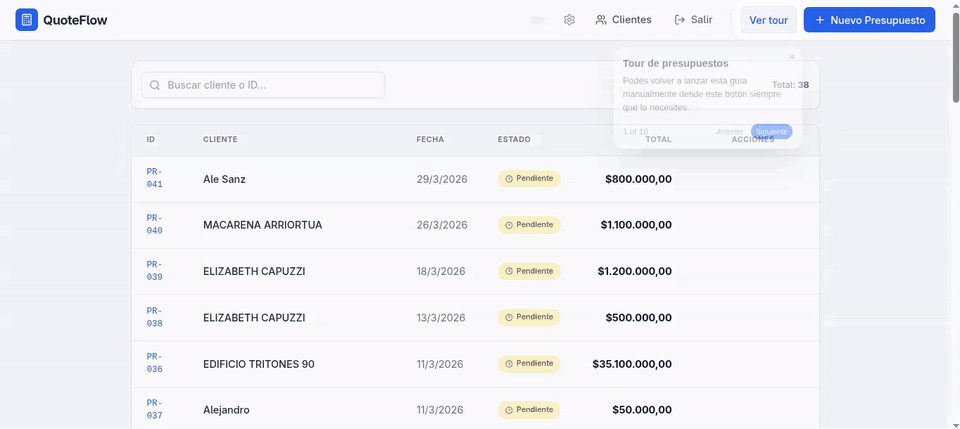

# Product Tour Skill

Skill enfocada en **tours interactivos de producto** para apps web: onboarding guiado, walkthroughs paso a paso y experiencias con **spotlight/highlight overlay** sobre elementos reales de la UI.

> Alcance de esta skill: **solo tours interactivos**. No está pensada para videos, motion demos ni formatos fuera del onboarding dentro de la interfaz.

## Qué hace esta skill

Esta skill ayuda a:

- identificar cuándo conviene implementar un product tour;
- elegir una librería adecuada según el stack;
- estructurar pasos de onboarding claros y mantenibles;
- resaltar elementos con overlay, tooltip y navegación entre pasos;
- persistir el estado del tour cuando el usuario ya lo completó.

## Casos de uso

- Primer ingreso de un usuario a la app
- Explicación guiada de un dashboard o backoffice
- Tours de features nuevas
- Onboarding contextual dentro de flujos complejos

## Librerías y enfoques cubiertos

- **Driver.js**
- **Shepherd.js**
- **Intro.js**
- **Implementación custom con CSS/JS**

## Demo visual



> Si querés reemplazar este recurso, poné acá el GIF final de la demo de onboarding interactivo.

## Contenido del repositorio

### Archivo principal

- `SKILL.md` — instrucciones de uso, flujo recomendado y criterio para elegir herramienta.

### Referencias

- `references/libraries.md` — comparación rápida entre enfoques y librerías.
- `references/driverjs.md` — guía práctica para implementar tours con Driver.js.
- `references/custom-css.md` — base para construir un tour sin depender de una librería externa.

## Uso recomendado

1. Leé `SKILL.md` para entender cuándo aplicar la skill.
2. Elegí la estrategia según el stack y el nivel de personalización.
3. Tomá una referencia de `references/` como punto de partida.
4. Adaptá los pasos del tour a tu interfaz real.

## Estructura

```text
.
├── README.md
├── SKILL.md
├── showcase.gif
├── package.json
└── references/
    ├── custom-css.md
    ├── driverjs.md
    └── libraries.md
```

## Instalación local

Para instalar esta skill, no hace falta correr `npm install`.

Lo que tenés que hacer es ubicar esta carpeta dentro de un directorio de skills del agente que uses.

Ejemplos:

```bash
# Agente con skills en ~/.agents/skills/
cp -R Product-tour ~/.agents/skills/

# Claude con skills en ~/.claude/skills/
cp -R Product-tour ~/.claude/skills/

# Ruta personalizada
cp -R Product-tour /ruta/personalizada/mis-skills/
```

Si tu agente usa otra ubicación, copiá o mové la carpeta `Product-tour` al directorio de skills configurado en ese entorno.

## Nota

Este repo funciona como **skill reusable + documentación de apoyo**. No es una librería de runtime lista para importar, sino una base clara para implementar tours guiados interactivos en productos web.

# Apoyo y Donaciones


Gracias por apoyar este proyecto. Tu aporte permite sostener el mantenimiento, mejorar la calidad del código y dedicar tiempo a nuevas funcionalidades.

## Donar con QR

Escaneá el siguiente código QR para realizar una donación:


## Donar con PayPal

Podés donar directamente a través de PayPal usando este correo:

`casserafernando@gmail.com`

- [Donar por PayPal (correo)](mailto:casserafernando@gmail.com)

## Cómo ayudar sin donar

- Dejá una estrella al repositorio para aumentar su visibilidad.
- Reportá errores o mejoras desde la sección de issues.
- Enviá pull requests con correcciones o nuevas ideas.
- Difundí el proyecto en redes, comunidades o entre colegas.

## Transparencia

Las donaciones se destinan a cubrir infraestructura, tiempo de mantenimiento y mejoras continuas del proyecto.

## Contacto y soporte

Si necesitás ayuda o querés colaborar, abrí un issue en este repositorio o contactame por correo.
